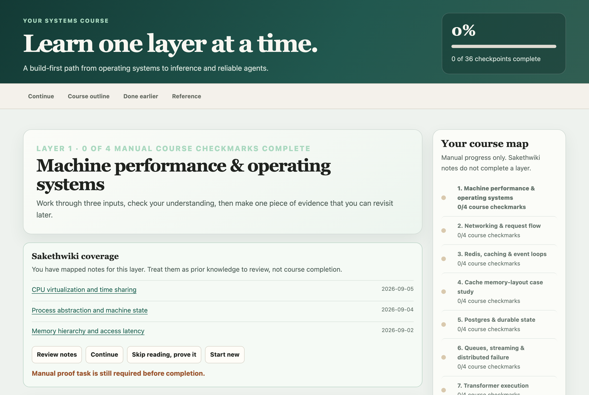

# Systems → inference learning roadmap

A private, local learning control center for a nine-layer path from machine and OS fundamentals, networking, caching, Postgres, and queues to transformer execution, inference serving, and agent harnesses. Each layer pairs study resources (including [Backend from First Principles](https://backend-from-first-principle.vercel.app/)) with a "prove it in code" lab and an exit gate.

It reads [SakethWiki](https://github.com/Sakethv7/SakethWiki) notes from an Obsidian vault, read-only, and maps them onto the layers as live evidence. Ingesting a note never marks a layer complete; completion stays a human decision. Python standard-library server, SQLite progress store, Docker, loopback-only by default. Design docs live in `docs/`.



*Screenshot uses a small demo vault, not real notes.*

Open **http://127.0.0.1:8768/** while the local app runs.

## Docker app

```sh
cd systems-to-inference-roadmap
SAKETH_VAULT_PATH=/path/to/your/vault docker compose up -d --build
```

Stop it with:

```sh
docker compose down
```

The Docker app mounts Sakethwiki read-only from `$SAKETH_VAULT_PATH` (an Obsidian vault) and stores app progress in `./data/learning-app.sqlite3`. To use a different vault path:

```sh
SAKETH_VAULT_PATH=/path/to/SakethVault docker compose up -d --build
```

The published port is local-only by default: `127.0.0.1:8768`. To avoid a port conflict:

```sh
LEARNING_PORT=8770 docker compose up -d --build
```

Then open `http://127.0.0.1:8770/`.

## Plain Python fallback

```sh
cd systems-to-inference-roadmap
python3 server.py
```

Stop with Ctrl+C. No login service is installed. This app is local to this Mac.

The live panel reads Sakethwiki conceptual notes every 10 seconds while the tab is visible. “Roadmap topics” shows known curriculum matches; “All notes” includes unmapped notes. Note links open the SakethVault vault in Obsidian. Connection failures preserve the last displayed evidence and label it stale. The site does not change source notes or automatically award completion. New notes do not automatically rewrite the separately dated reviewed position/next reading; the existing daily review remains in place for that assessment.

## Your completion progress

All nine layers are required: machine and OS, networking, Redis/caching, memory layout, Postgres, queues/distributed failure, transformer execution, inference serving, and agent harnesses. The home screen shows one current lesson, a compact nine-layer outline, and a completed-work revisit list. A bounded ML execution bridge is required before Layer 7, and a cross-cutting safety/control track starts after Layer 6; neither adds a numbered layer. The 36 checkpoints remain canonical. New selections are stored locally with a timestamp; prior v1 selections are preserved as `Previously marked complete — date unavailable`. Version 1 exports remain importable and new exports use version 2. Import previews changes and requires confirmation. Use the same address (127.0.0.1:8768) consistently; localhost is a different browser origin.

## Verification

```sh
python3 -m unittest discover -s tests -v
# Browser test: run against a throwaway server, never the real one on 8768.
python3 server.py --port 8799 --vault ~/SakethVault --state /tmp/qa.sqlite3 &
BASE_URL=http://127.0.0.1:8799 node tests/test_live.mjs
```

The browser test syncs progress to the server it targets and imports "all 36 complete", so pointing it at 8768 overwrites your real progress. It needs Playwright installed (`npm i -D playwright`). Tests do not modify the real vault.

## iPad access (Tailscale)

The iPad reaches the Mac's app over your private tailnet; the container stays bound to loopback. Design and tradeoffs: `docs/private-app/`.

1. Turn on Tailscale on the Mac. In the admin console, enable MagicDNS and HTTPS certificates.
2. Proxy the tailnet name to the app (persists across reboots): `tailscale serve --bg --https=443 http://127.0.0.1:8768`
3. Allow that hostname and restart: `APP_ALLOWED_HOSTS=<mac>.<tailnet>.ts.net docker compose up -d` (or put it in a `.env` file next to `compose.yaml`).
4. On the iPad, install Tailscale and sign in to the same account. Open `https://<mac>.<tailnet>.ts.net` in Safari → Share → Add to Home Screen.
5. Keep the Mac reachable: System Settings → Battery → Power Adapter → "Prevent automatic sleeping when the display is off".

If both devices edit at once, the older copy is refused and reloads with "Updated on another device — reloaded."

## Recovery

Before-live files are in backups/2026-09-08-pre-live/. Stop the service to disable live access. Restore only the desired portions of the backup if reverting the presentation; preserve later edits. There are no vault writes, database migrations, external uploads or remote deployments to undo. Keep exported progress before changing browser origin or clearing storage.
