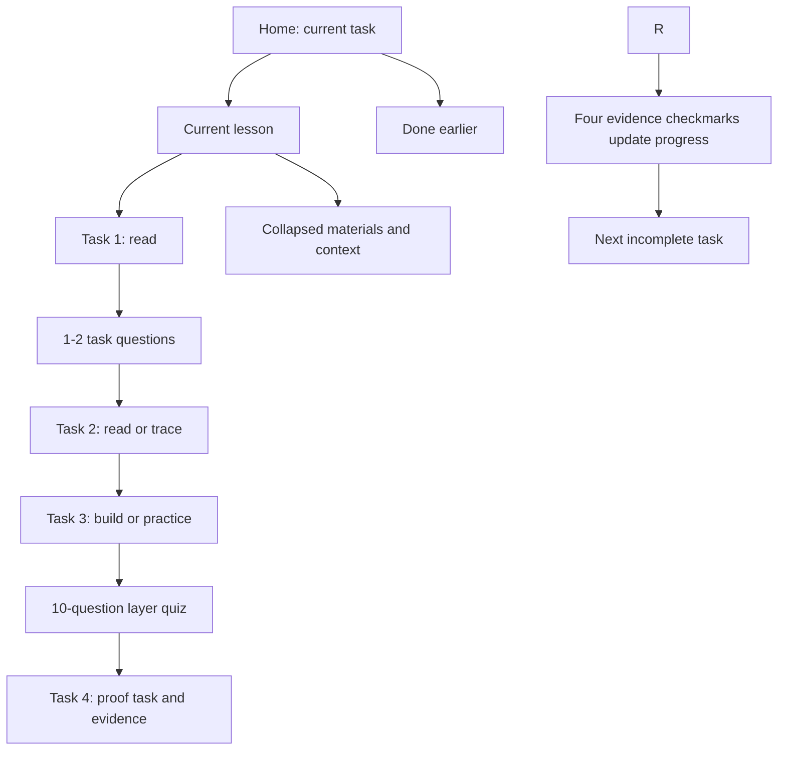

# Learning control-center architecture

**Status:** implemented September 11, 2026.

## Problem observed

The current page places a course wrapper around a long reference document. A learner opens a lesson, sees dense study and code sections, and has to find the completion area and infer which resource earns each checkbox. The home page also shows an outline, history, and reference material before the actionable lesson.

## Decision

Make the local roadmap a task-oriented learning control center.

1. **Home** shows only the current task, progress, the next three tasks, and a compact completed-history link.
2. **Lesson** shows four ordered task cards. The first three are inputs (`Read`, `Trace`, or `Build`); each has one existing checkbox, a short purpose, one primary resource link, and an explicit piece of evidence to keep. The fourth is the proof task.
3. Each input task ends with one or two retrieval or reasoning questions. They give immediate feedback before the learner marks the task's evidence.
4. Each layer then gives a ten-question mixed quiz, followed by the proof task. The quiz checks concepts; the proof is the concrete artifact, trace, measurement, diagram, or explanation that earns the fourth evidence checkmark.
5. Detailed prose, alternate resources, code sketches, system-design links, and reading feeds move into a collapsed `Materials and context` area. They support the task; they do not compete with it.
6. System design and coding cease to be separate destinations. When relevant, they appear only as the `Build` or `Practice` input for the current layer.
7. The course outline remains available as a compact map. `Done earlier` remains a revisit list with the same timestamps.

## Invariants

- Preserve the nine ordered layers and exactly 36 canonical checkbox meanings.
- Quiz scores are practice feedback. They never mark a task or layer complete automatically.
- Existing v1/v2 local progress, exports, imports, dates, explicit import confirmation, and the read-only Sakethwiki feed remain compatible.
- A live note remains evidence exposure only; it never checks a task or changes the reviewed position.
- No new remote service, account, vault write, or submission flow is introduced.

## Page shape

