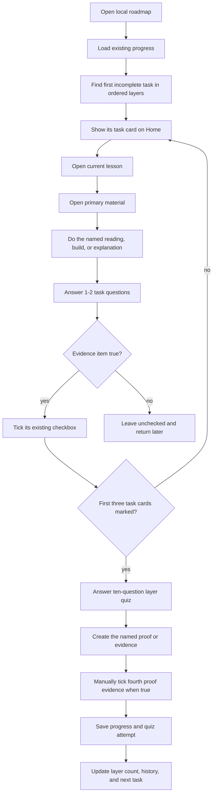

# Learning control-center logic flow

**Status:** implemented September 11, 2026.

## Rules

1. One task maps to one existing checkbox; no task or quiz can silently complete another.
2. The primary link is sufficient to start. Alternate material is optional and collapsed.
3. A task check has one or two questions. A layer assessment has ten questions. Both show immediate feedback and record attempts locally.
4. The proof task asks for an explanation, trace, diagram, measurement, or test result in the learner's own notes. It is not automatically graded.
5. A `Build` or `Practice` task may link to a coding or design exercise, but it remains part of the current layer.
6. A completed checkbox can be unticked; its existing timestamp behavior remains unchanged.
