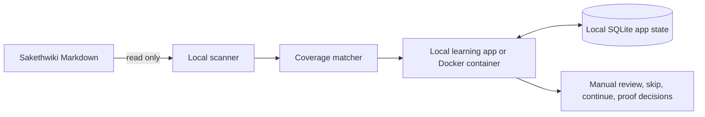
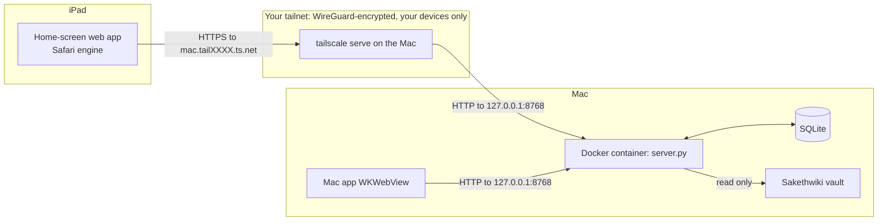

# Local-first private learning app

**Status:** implemented locally September 11, 2026. iPad access section proposed September 22, 2026 — awaiting approval.  
**Audience:** Saketh only, for daily use on this Mac and (proposed) on Saketh's iPad.

## Decision

Evolve the existing loopback app at `127.0.0.1:8768` into the source of truth for learning progress and knowledge coverage. It runs either as a plain Python process or as a Docker Compose app that publishes only to loopback, mounts Sakethwiki read-only, and stores only app-owned state in a local SQLite database.

The hosted private Site remains a portable course reader. It cannot read the Mac-local vault and is not the coverage authority.

## First usable slice

For each course layer, the local app shows:

- relevant existing notes and direct Obsidian links;
- coverage state: `not found` or `directly covered` in this first slice;
- explicit missing concepts and required evidence;
- a recommendation: `review`, `continue`, `skip reading and prove`, or `start new`;
- a manual user decision separate from task completion.

## Invariants

- Never write, rename, tag, or move vault notes.
- Coverage is not mastery and never auto-completes or auto-skips a task.
- Matching uses deterministic topic mappings first; uncertain matches are not auto-classified yet.
- The database stores only course state, coverage summaries, note identifiers, titles, dates, hashes, mappings, and user decisions. It does not store raw vault bodies.
- Bind only to `127.0.0.1`; no CORS, remote sync, or public endpoint. *(Proposed amendment below: the process still binds only to loopback, but Tailscale may forward private-network requests to it.)*
- Docker publishes only to `127.0.0.1` and mounts the vault read-only.

---

## Proposed: iPad access over Tailscale

### The problem in one paragraph

The app has two halves that cannot move to the iPad. The scanner needs to read the Obsidian vault on this Mac's disk, and the SQLite file lives on this Mac. The iPad can still show the page and send progress updates, as long as it can reach the Mac. So the design question is not "how do we run the app on the iPad". It is "how does the iPad reach a server that is deliberately invisible to every other machine".

### Terms used below

- **Loopback (`127.0.0.1`).** A network address that means "this same machine". A server bound to it cannot be reached from any other device, even on the same Wi-Fi. That is why the app is private today.
- **Tailnet.** Your private Tailscale network. Every device signed into your Tailscale account gets an address on it, and devices outside the account cannot reach those addresses. Traffic between devices is end-to-end encrypted with WireGuard.
- **MagicDNS name.** The stable hostname Tailscale gives each device, such as `sakeths-mac.tail1234.ts.net`. It resolves only inside the tailnet.
- **`tailscale serve`.** A small reverse proxy built into Tailscale. A reverse proxy is a program that accepts requests on one address and forwards them to another. Here it accepts HTTPS on the Mac's tailnet name and forwards to `http://127.0.0.1:8768`. It also obtains a real TLS certificate for the `ts.net` name, so Safari shows a normal padlock.
- **Home-screen web app.** Safari's "Add to Home Screen" saves a page as an icon. With the right `<meta>` tags and a web manifest (a small JSON file naming the app, icon, and colors), it opens full-screen without Safari's address bar, so it looks like an app.

### Why this shape

The server keeps binding to loopback. Docker keeps publishing only to `127.0.0.1`. Nothing on the Mac opens a new listening port to the LAN or the internet. The only new path is: Tailscale daemon on the Mac → loopback → container. Tailscale is therefore the gate, and it only admits devices on your account.

*Caption: the iPad never talks to the container directly. It talks to Tailscale on the Mac, and Tailscale forwards over loopback. The Mac app keeps its existing direct loopback path.*

### Complexity tier

**Single-process tool**, unchanged. There is still one Python process in one container, and one SQLite file. Tailscale is an off-the-shelf proxy we configure, not a service we write. A multi-service design (cloud sync, a hosted database, an offline-first iPad cache with merge logic) would let the iPad work while the Mac sleeps. The problem does not need that yet, and it would add conflict resolution, a second copy of private data, and a deployment. See ADR 2 for what that gives up.

### Components touched

| Component | Change |
|---|---|
| Tailscale on the Mac | Turned on; `tailscale serve --bg --https=443 http://127.0.0.1:8768`; MagicDNS and HTTPS certificates enabled in the tailnet admin console. |
| Tailscale on the iPad | Install the iOS app, sign in to the same account. |
| `server.py` host check | Also accept requests whose `Host` is listed in a new `APP_ALLOWED_HOSTS` env var, with an `https://` origin. Unset means today's behavior exactly. |
| `server.py` progress write | Reject stale whole-state writes (ADR 3) so Mac and iPad cannot silently overwrite each other. |
| `server.py` static assets | Serve `/manifest.webmanifest` and `/icon.png`. |
| `compose.yaml` / `Dockerfile` | Pass `APP_ALLOWED_HOSTS`; copy the manifest and icon into the image. |
| `index.html` | Manifest link, Apple home-screen meta tags, 44px minimum tap targets, refetch progress when the page becomes visible, handle the stale-write rejection. |
| Mac sleep setting | Saketh changes it (system setting, not automated): prevent automatic sleep on power adapter when the display is off. |

### Deployment shape

Nothing new is deployed. The container runs as today with `restart: unless-stopped`. Tailscale's serve configuration is persistent across reboots once set with `--bg`.

### What the iPad can and cannot do

It can read lessons, tick checkpoints, write evidence notes, take quizzes, record decisions, and see Sakethwiki coverage, because all of that is served by the Mac. It cannot do any of that while the Mac is asleep, off, off the network, or while Docker Desktop or Tailscale is stopped. In those cases the home-screen app shows Safari's "cannot connect" page. `obsidian://` note links work only if Obsidian is installed on the iPad with the same vault synced.

## Open questions

1. **Does `tailscale serve` forward the original `Host` header?** The host check depends on it. The design assumes the container sees `Host: <mac>.<tailnet>.ts.net`. The first manual test should confirm it before the allowlist value is fixed. If Tailscale rewrites `Host` to `127.0.0.1:8768`, the check passes without the allowlist, and the origin check needs changing instead.
2. **Should the server also verify Tailscale's identity header?** `tailscale serve` adds a `Tailscale-User-Login` header naming the signed-in account. Requiring it to equal Saketh's login would also block other people's devices if the tailnet is ever shared. The tailnet is single-user today, so this is left out for simplicity.
3. **Contradiction with `docs/architecture.md` line 9.** That file says phone or remote access "requires a separately designed private publishing/sync connection". This section is that design. If approved, line 9 should point here instead of being silently contradicted.
4. **Resolved during implementation (September 22):** `hydrateAppState` now adopts server state only when the client has no unsaved edits and the server version differs.
5. **Remaining last-write-wins windows.** A client that never received an `updated_at` sends no `base_updated_at`, and the server accepts it (compatibility). That happens on a brand-new database, or when the first load's GET failed. Also, quitting the Mac app within 500 ms of an edit may not fire `pagehide` in `WKWebView`. That edit then stays in `localStorage` but is replaced by the server copy on next launch. Both are rare, and neither is fixed.
