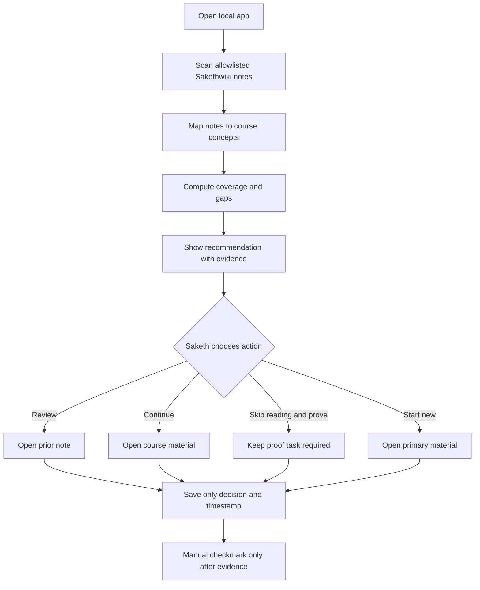

# Local coverage and learning-decision flow



## Rules

1. `directly covered` means an existing note matches the defined concept and source mapping; it does not mean complete.
2. A skip decision expires when the mapped note changes materially or the learner explicitly revisits the task.
3. A proof task cannot be skipped automatically.
4. The matching explanation lists the notes and concepts that led to the recommendation.

---

## Proposed: iPad request path

### Path 1 — opening the app on the iPad

1. Saketh taps the home-screen icon. Safari's engine opens `https://<mac>.<tailnet>.ts.net/` full-screen.
2. The Tailscale app on the iPad routes the request over the encrypted tailnet to the Mac.
3. `tailscale serve` on the Mac terminates TLS and forwards it as plain HTTP to `127.0.0.1:8768`.
4. The container's `allowed()` check runs. It accepts because `Host` is in `APP_ALLOWED_HOSTS` and any `Origin` is `https://` plus that same host.
5. The server returns `index.html`; the page loads `/api/progress` and `/api/coverage` the same way.

### Path 2 — saving progress from either device

```mermaid
sequenceDiagram
  participant C as Client (Mac or iPad)
  participant S as server.py
  participant D as SQLite
  C->>S: PUT /api/progress {state, base_updated_at: T1}
  S->>D: BEGIN; read updated_at
  alt stored updated_at == T1
    S->>D: write state, updated_at = T2
    S-->>C: 200 {state, updated_at: T2}
    Note over C: remember T2 as next base
  else stored updated_at != T1 (other device wrote)
    S-->>C: 409 {current state, updated_at: T3}
    Note over C: adopt current state, re-render,<br/>show "Updated on another device"
  end
```

*Caption: each save says which version it was based on. If another device saved in between, the server refuses the stale save and hands back the newer state instead of overwriting it.*

### Path 3 — switching devices

1. The page listens for `visibilitychange` and window `focus`. Focus matters for the Mac app: switching back from another app does not change visibility when the window stayed on screen. When the page becomes visible or focused, it GETs `/api/progress` and replaces in-memory state if the server's `updated_at` differs from the one it holds.
2. Writes are debounced (500 ms after the last change) and sent one at a time. A save requested while another is in flight waits for it, so the client never sends two writes based on the same version.
3. When the page is hidden or unloaded (`pagehide`), a pending save is sent immediately with `keepalive`, so closing the home-screen app right after an edit does not drop it.

### State of a client's copy

```
fresh ──local edit──▶ dirty ──PUT──▶ saving ──200──▶ fresh
  ▲                                     │
  └────────── adopt server state ◀─409──┘
  ▲
  └── page visible + server newer ── (from fresh only; a dirty copy saves first)
```

### Failure behavior

| Failure | What Saketh sees | Data effect |
|---|---|---|
| Mac asleep / off / off-network | Safari "cannot connect" page on the iPad | None. Nothing was sent. |
| Tailscale stopped on either device | Same as above | None. |
| Docker Desktop stopped | `tailscale serve` returns 502 Bad Gateway | None. |
| Connection drops after the page loaded | The save fails; the page shows its existing "not saved" state | The edit stays in that tab's memory and iPad `localStorage`. It is lost if the tab is closed before the connection returns, because the next load adopts the server copy. Offline queuing is ADR 2 option D, not in scope. |
| Two devices save at the same moment | Second one shows "Updated on another device — reloaded" | The second device's unsent edit is discarded (ADR 3). |
| Host not in allowlist (misconfigured) | 403 `Cross-origin access denied` | None. Fails closed. |

No automatic retries. A failed save leaves the client dirty, and the next edit or visibility change tries again.
