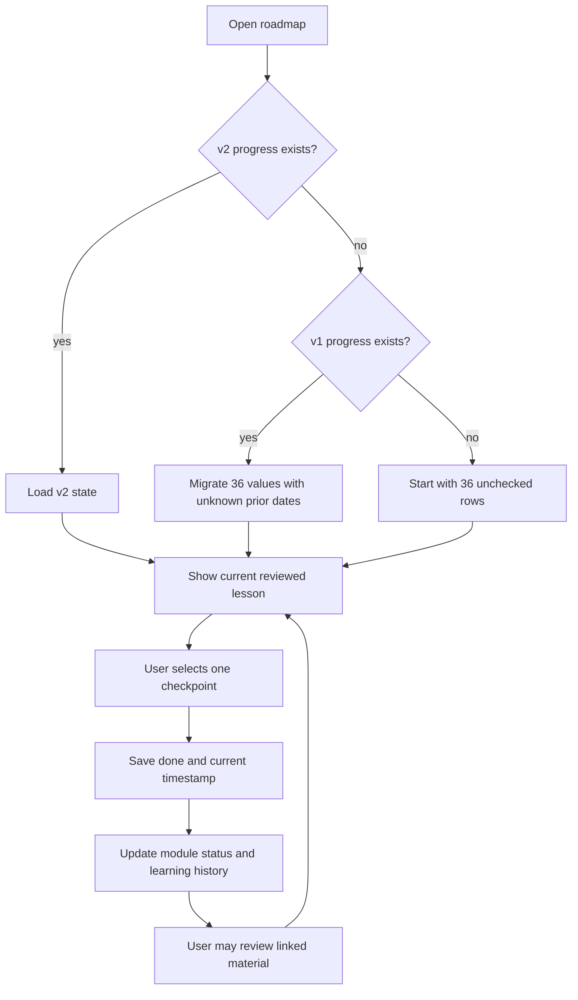

# Course-progress logic flow

## Rules

1. The first incomplete numbered module decides the default open module and next lesson.
2. A completion selection updates exactly one checkpoint and its timestamp.
3. Unselecting a checkpoint removes only that checkpoint's timestamp and returns it to incomplete.
4. `Complete` means all four checkpoints in a numbered layer are selected. It never means the learner has mastered the topic.
5. ML bridge and safety-control evidence remain prerequisites shown in relevant modules; they do not create a new numbered layer or inflate percentage progress.
6. Import is previewed and explicitly confirmed. No import runs automatically.
